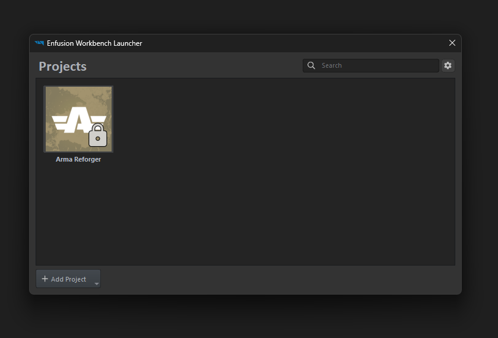
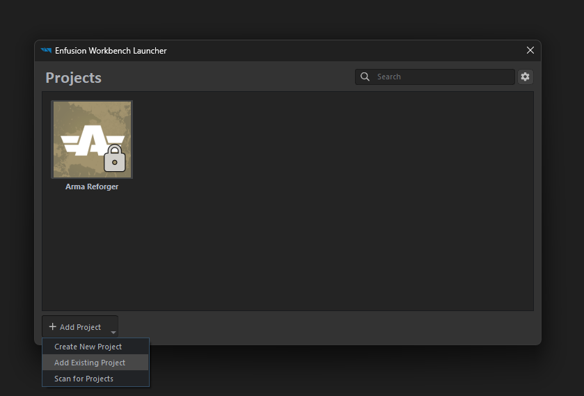
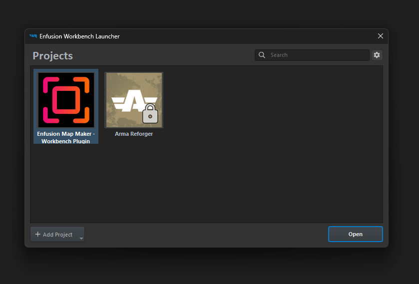
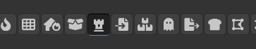
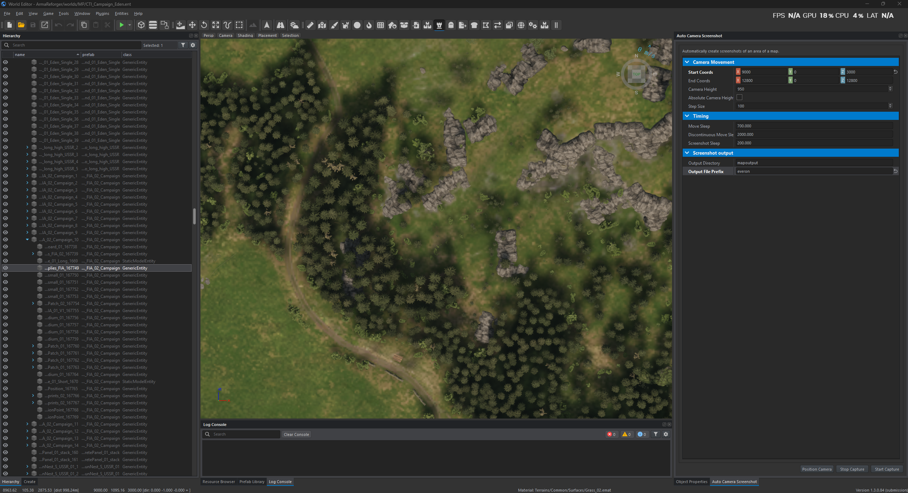
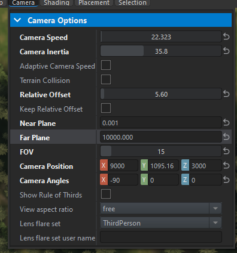
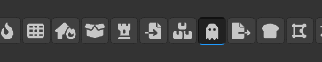
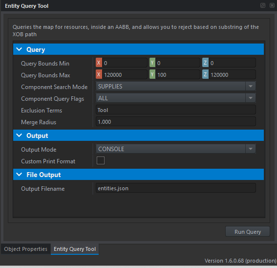

# Enfusion Map Maker

This project implements two tools for the Enfusion World Editor. The first automates taking screenshots of the map at regular intervals. The resulting screenshots can then be processed into tiles suitable for integration with a panning/zooming tiled map system like LeafletJS. The second plugin can run queries against the map, and extract location data into a JSON file.

Both of these plugins are used for the Everon Supply Location map, which can be found in the `Web/` folder. The dynamic, scrolling map is made using the [LeafletJS](https://leafletjs.com) library.

# Guide

This requires you to have installed the Arma Reforger Tools, and have some kind of Python interpreter installed. I developed this using WSL Linux, so if you use a different installation of Python, then there might be minor issues with the Python scripts.

1. Open Arma Reforger Tools



2. Choose add existing project



3. Navigate to the Enfusion folder, and select addon.gproj



4. Open the Enfusion World Editor with your map of choice

## Auto Screenshot Tool

5. Locate the Auto Screenshot Maker Tool in the tool bar. It has a castle/rook/tower
chess piece icon.



6. Open the right panel, and configure the plugin as required



7. Configure the panel to your needs, and press the start button

8. Configure the game camera in the editor to have an FOV of 15, and a far plane of 5000



**IMPORTANT:** Ensure the editor camera is set to an FOV of 15, and a far plane greater than 4500. This cannot be automated, so you must do this manually, and there are no warnings if you forget.

9. Go to **View -> Toggle Visualisers** and disable all visualisers. This will prevent them from appearing in the screenshots.

10. Optionally disable elements in the map which will still present debug visualisations but are not disabled with the above step. Typically these are military installation prefabs named `ConflictMilitaryBase`, which render as a large white cylinder. 

11. Run a test of the process by pressing the **Start capture** button at the bottom of the panel, and you should start seeing the camera move around the map, taking screenshots at regular intervals, saving files to the specified directory.

The output directory is configured as the `$profile` directory of Workbench, which is typically `C:\Users\<USERNAME>\Documents\My Games\ArmaReforgerWorkbench\profile\`.

Now stop the process by either hitting the escape key, or **Stop capture** button, and delete these test screenshots, as there's one more step to do before you can use them.

12. **IMPORTANT:** Immediately after starting the process, hit F11 to ensure the camera is full screen. This is currently the only effective way to ensure the camera size is consistent for each capture session. All the defaults listed here are configured for a 1440p monitor, so if you have a different resolution, you may need to adjust the camera settings.

Now let the process run until it completes, and you have a full set of screenshots.

At any point you may interrupt the process, and when resuming, it will continue from where it left off. You can even run the `Scripts/crop_screenshots.py` to crop the screenshots to the correct size, and then resume the process. It will detect both uncropped and cropped images. This is useful if you are running low on disk space, as the PNG screenshots can be large.

## Creating tiles - Cropping

There are two Python scripts which are used to create tile sets for the webpages. The first script is `Scripts/crop_screenshots.py`, which crops the screenshots to the correct size. Both of these scripts require the [pillow](https://pypi.org/project/pillow/) image processing library.

```
python crop_screenshots.py <input directory> <output directory> [-m]
```

If you're using my default tile setup, then the sizes are already set, so you don't need to dial in a crop size. If you do want a custom tile size, the process is this.

1. Edit the `crop_screenshots.py` script and set the `TILE_SIZE` variable to the size you want. This should be larger than the target size, so you see repetition when they are composited together. Then run the script with the `-m` flag, which will create an output image with all the tiles you've collected stitched together.

If they have repetition at the borders, edit the `TILE_OFFSET` variable by increasing the negative value, and re-running the script. This will move the tiles closer together, and reduce the repetition. Once you have found the correct value, you can then run the script without the `-m` flag, and it will create the initial croped tile images to the correct size.

## Creating tiles - Zoom levels

The second script is `Scripts/create_zoom_levels.py`, which creates the tiles from the cropped screenshots.

```
python create_zoom_levels.py <input directory> [-f]
```

You simply point this at the directory where your LOD 0 images have been created from the `crop_screeenshots.py` script.

## Compression

Lastly, there is a bash script named `compress_tiles.sh` which can use [ImageMagick](https://imagemagick.org) to further compress the tiles if required. Edit the script to configure the desired directory paths.

## Example runthrough

The paths will need altering, but the process will look like this. `compress_tiles.sh` will look for a subfolder called `LODS/` and create a new folder called `Compressed_LODS/` containing the final images.

#### Linux
```
pip install Pillow
cd /path/to/EnfusionMapMaker
python Scripts/crop_screenshots.py some/folder/path Web/<mapname>/LODS
python Scripts/create_zoom_levels.py Web/<mapname>/LODS
# Optional, linux-only step to compress the tiles
./compress_tiles.sh Web/<mapname>/
```

#### Windows

Grab the latest version of Python from [python.org](https://www.python.org/downloads/), and then run the following commands in a command prompt.

```
py -m pip install Pillow
cd \Path\To\EnfusionMapMaker
py Scripts\crop_screenshots.py "C:\Users\<YOUR USERNAME>\Documents\My Games\ArmaReforgerWorkbench\profile\<YOUR MAP NAME>" Web\<YOUR MAP NAME>\LODS
py Scripts\create_zoom_levels.py Web\<YOUR MAP NAME>\LODS
```

It's recommended to capture a small area of the map first. For example, coordinates `1000,1000` to `2000,2000` and then run the scripts on that area to ensure everything is working correctly. Once you have a good set of tiles, you can then run the scripts on the full map.

## Extracting the location information



Add the **Enfusion** directory as a mod, and then look for the **Ghost** icon in the toolbar. This will give you access to the location extraction tool and its various options.



*Query Bounds Min/Max* allows you to restrict the query to apply only to a certain region.

*Component Search Mode* dictates which `EResourceType` you are running a query for.

*Component Query Flags* is exposed as one of the parameters passed to [`QueryEntitiesByAABB()`](https://community.bistudio.com/wikidata/external-data/arma-reforger/ArmaReforgerScriptAPIPublic/interfaceSCR__WorldEditorToolHelper.html#ac2b5c818551c292a3f8898edff9ba81b). I've not noticed any issues by leaving this as the default value.

*Exclusion Terms* is used as a filter to remove unwanted matches from the exported data. I've found that the only problems are caused by wall mounted tool racks, so the default value will filter out anything with the word "Tool" in it. This might change in future updates.

*Merge Radius* is currently non-functional, so should be ignored.

*Output Mode* dictates whether the results from the query are printed to the editor console, or written to a JSON file.  *Custom Print Format* is a toggle for [some custom code](https://github.com/nickludlam/EnfusionMapMaker/blob/b3d5aa94b447c404620ff371ed65ce22d6aa3556/Enfusion/Scripts/WorkbenchGame/EnfusionMapMaker/ResourceQueryWorldEditorTool.c#L324) I used while exploring the returned data. You do not need to use this unless you want to also edit the underlying plugin code.

Output Filename controls the filename written to the output directory `C:\Users\<USERNAME>\Documents\My Games\ArmaReforgerWorkbench\profile\`.

Once you have configured the query, you then use the *Run Query* button on the bottom right.

# License

This project is licenced under the **Arma Public License Share Alike (APL-SA)** license. See the [LICENSE](LICENSE) file.